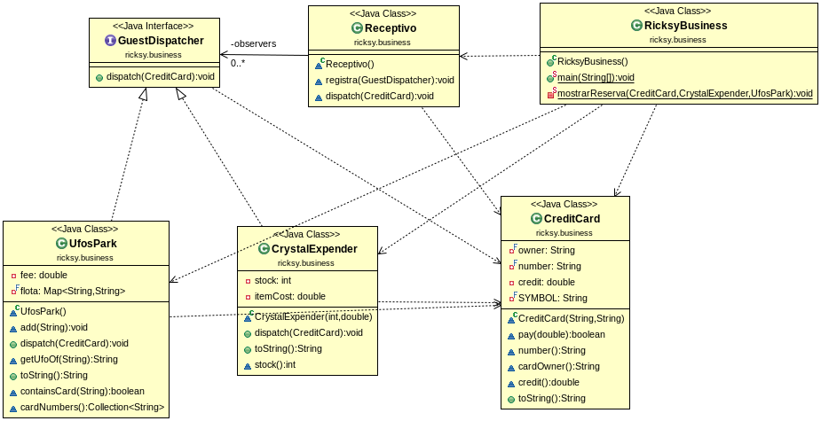

# Ricksy Business Kata

> In this repository you'll find **Ricksy Business Kata**. This kata is the perfect introduction to get to understand the Observer Pattern and get to know how work the dependencies between the objects that follow this pattern. It's the perfect introduction to anyone that never had done any other project following the Observer Pattern and what to get an idea of how it works. Really enjoyable and easy to follow following the UML Diagram like a guide to develop the program. Easy and quick to do, but if you, like me, never heard anything before about the Observer Pattern my advice is to look for some information to understand how it works otherwise you'll miss the goal of this project, in my case it really has helped me read this article, if your interest, check it out please !

> https://howtodoinjava.com/design-patterns/behavioral/observer-design-pattern/#:~:text=According%20to%20GoF%20definition%2C%20observer,as%20the%20publish%2Dsubscribe%20pattern.

## Table of Contents

1. [Motivation](#motivation)
1. [Used Technologies](#used-technologies)
1. [Reflections](#reflections)
1. [UML Diagram](#uml-diagram)
1. [License](#license)

---

## Motivation

The motivation for this project, it has been to introduce myself into the GoF Design Patterns, especially in this kata into the Observer Pattern. After getting all the information on the internet that I thought it was enough to start and get an idea of how everything should work I start to code. If you're looking for some extra motivation that will push you to do try this kata, one of mine main motivation was specially the fact of be part of a concrete episode of Rick and Morty, if you're interested to watch the episode before try this kata I'll let you know that the episode is the number 11 from the first season, really worth it to watch. The best feeling of this kata is the satisfaction when you get the expected results and you see how everything connected work completely fine and if you didn't have noticed before about which one is the difference between the observer and the observable after this point everything will start to make sense for you.

---

**[⬆ back to top](#table-of-contents)**

## Used Technologies

- Java
- Junit
- Maven
- Jacoco
- MarkDown
- Github

---

**[⬆ back to top](#table-of-contents)**

## Reflections

My opinion about this kata is that after my period programming with Java and increasing the level after every project I've found this one relatively easy, or maybe a bit easier than what I was expecting. You don't need to be worried this just has happened to focus yourself about the Observer pattern and less into hard bits that you don't know how to go over. This is really clever in my opinion and has helped me a lot. Another main point to distinguish from this kata is the UML diagram, just looking at it without code anything before you can know which one is the observer and the observable entities. I totally recommend this kata to anyone that will like to introduce theriself into the design patterns and maybe not to this person that already have some knowledge about them. And the last thing to add is that you'll be surprised if you get to the end of this kata because you'll have to develop a class that is not actually in the UML diagram but don't worry, you'll realize that is so similar to another one that already has your program then I'll let you enjoy the satisfaction that you'll get after finish it all, like it has happened to me too. 

---

**[⬆ back to top](#table-of-contents)**

## UML Diagram

> This UML Diagram has been provided by https://github.com/dfleta

---

**[⬆ back to top](#table-of-contents)**

## License

MIT License

Copyright (c) 2020 AntoniPizarro and Pau Llinàs

Permission is hereby granted, free of charge, to any person obtaining a copy
of this software and associated documentation files (the "Software"), to deal
in the Software without restriction, including without limitation the rights
to use, copy, modify, merge, publish, distribute, sublicense, and/or sell
copies of the Software, and to permit persons to whom the Software is
furnished to do so, subject to the following conditions:

The above copyright notice and this permission notice shall be included in all
copies or substantial portions of the Software.

THE SOFTWARE IS PROVIDED "AS IS", WITHOUT WARRANTY OF ANY KIND, EXPRESS OR
IMPLIED, INCLUDING BUT NOT LIMITED TO THE WARRANTIES OF MERCHANTABILITY,
FITNESS FOR A PARTICULAR PURPOSE AND NONINFRINGEMENT. IN NO EVENT SHALL THE
AUTHORS OR COPYRIGHT HOLDERS BE LIABLE FOR ANY CLAIM, DAMAGES OR OTHER
LIABILITY, WHETHER IN AN ACTION OF CONTRACT, TORT OR OTHERWISE, ARISING FROM,
OUT OF OR IN CONNECTION WITH THE SOFTWARE OR THE USE OR OTHER DEALINGS IN THE
SOFTWARE.

---

**[⬆ back to top](#table-of-contents)**
